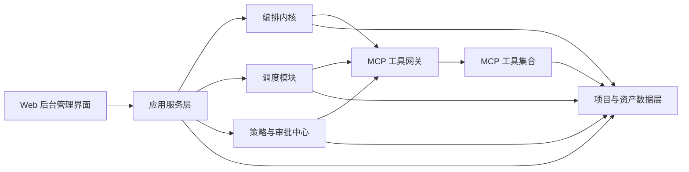
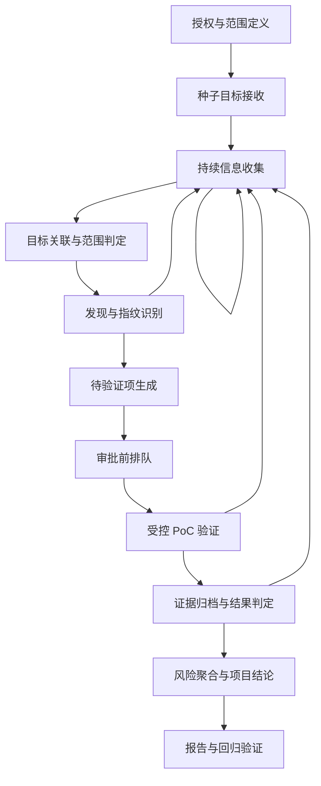

# 基于 LLM 编排内核的授权外网安全评估平台设计文档

## 1. 文档定位

本文档定义一个面向单人研究员的、基于 LLM 编排内核的授权外网安全评估平台首版设计。平台目标不是做一个前台聊天 Agent，也不是做一个无人值守的自动攻击系统，而是做一个具备项目管理、流程管理、资产沉淀、任务调度、人工审批、受控验证、证据归档和报告输出能力的后台管理平台。

本设计优先解决的问题是：

- 给定目标后，平台如何沿着常见渗透测试流程持续推进。
- 信息收集如何贯穿整个项目生命周期，而不是只在开头执行一次。
- LLM 如何稳定地充当后端“大脑”，负责判断阶段、拆分任务、选择工具能力、决定下一步，而不是与用户进行前台对话。
- 各类安全工具如何以 MCP 的方式统一接入，并在平台内部作为可扩展能力被调度。
- 高风险验证动作如何在人工逐项审批的前提下受控执行，并做到可审计、可回放、可中止。

## 2. 背景与设计目标

### 2.1 背景

在实际授权安全评估中，研究员通常会从公司名、域名、URL、IP 或网段开始，逐步做信息收集、资产发现、端口与服务识别、Web 与 API 入口发现、技术指纹识别、问题验证和结果记录。但现实中的流程不是线性的：

- 信息收集贯穿全过程。
- 任一阶段都可能发现新的资产、新入口、新线索。
- 新线索可能需要重新回到信息收集和范围判定阶段。
- 研究员需要同时管理项目、任务、证据、审批和报告，而不是只跑一堆工具命令。

因此，该平台需要将渗透测试流程抽象为一个可递归回流的、可审计的、可调度的状态系统。

### 2.2 设计目标

首版平台的核心目标如下：

1. 跑通匿名外网面项目流程。
2. 以后台管理界面为主要交互方式，不以聊天为核心交互。
3. 以 LLM 作为后端编排内核，而不是前台对话入口。
4. 统一通过 MCP 工具能力层执行所有动作。
5. 将高风险验证动作纳入逐项人工审批。
6. 将资产、识别画像、证据和结果沉淀为结构化数据。
7. 支持任务队列、定时调度、优先级、重试、并发限制与人工干预。
8. 先采用单机一体化部署，但为后续分布式后端扩展保留清晰边界。

### 2.3 首版成功标准

首版的成功标准不是工具数量最多，也不是最“智能”，而是：

- 给定目标后，平台能持续推进信息收集、资产关联、指纹识别、待验证项生成、审批、受控验证、证据归档与报告。
- 研究员能够明确知道项目当前处于哪个阶段、为什么停在这里、下一步建议是什么。
- 所有高风险动作都处于强审批、强审计、可中止的控制之下。
- 所有核心动作都通过 MCP 抽象层执行，并具备后续扩展空间。

## 3. 产品定位与总体原则

### 3.1 产品定位

本平台定义为：

**面向单人研究员的授权外网安全评估工作台。**

其本质是一个后台管理系统，前台提供项目与流程控制，后端由 LLM 充当编排内核，协同任务状态机、规则引擎、调度器和 MCP 工具网关，共同推动项目执行。

### 3.2 核心原则

1. **流程优先，不以聊天为中心。**
   用户主要通过结构化表单、项目页面、审批页面、按钮和配置项来驱动平台，而不是通过与 LLM 对话来控制平台。

2. **状态机优先，不让 LLM 直接自由发挥。**
   LLM 的职责是基于当前上下文判断阶段、生成候选任务和解释理由，但不能绕过规则引擎和审批门禁直接执行高风险动作。

3. **信息收集贯穿全程。**
   信息收集不是首阶段完成后就结束，而是会在整个项目生命周期中持续发生，并在新线索出现时触发回流。

4. **证据优先于结论。**
   平台中的所有问题结论都应能够回溯到具体证据、具体任务、具体审批单和具体执行记录。

5. **MCP 是一等公民。**
   所有工具能力必须通过统一的 MCP 抽象层接入，平台内部调度的是“能力”和“契约”，而不是硬编码某个具体工具。

6. **高风险动作强约束。**
   高风险验证动作必须逐项审批、限速、可审计、可暂停、可紧急停止。

## 4. 整体架构

### 4.1 架构概览

平台采用“单机一体化部署、模块边界清晰”的首版架构，后续可以逐步演进为分布式后端。

### 4.2 核心子系统

#### 4.2.1 Web 后台管理界面

负责为研究员提供统一操作入口，包括：

- 仪表盘
- 项目管理
- 项目详情
- 审批中心
- 资产中心
- 证据与结果
- 系统设置

#### 4.2.2 编排内核

平台的大脑，负责：

- 判断项目当前所处阶段
- 识别推进该阶段所需的输入与前置条件
- 根据当前资产、证据和历史结果生成候选任务
- 为候选任务给出优先级、风险等级与理由
- 判断哪些任务可自动执行，哪些任务必须转审批

#### 4.2.3 调度模块

负责控制任务的实际运行，包括：

- 任务入队
- 任务出队
- 定时调度
- 优先级调度
- 并发与速率控制
- 重试与失败恢复
- 审批阻塞
- 手工暂停、恢复、终止

#### 4.2.4 策略与审批中心

负责：

- 范围判定
- 风险分级
- 审批规则
- 默认超时
- 默认重试
- 执行门禁
- 紧急停止

#### 4.2.5 MCP 工具网关

作为平台统一的工具抽象层，对所有工具能力进行标准化接入与调度，屏蔽具体工具差异。

#### 4.2.6 项目与资产数据层

负责存储和关联以下内容：

- 项目与阶段
- 目标种子
- 资产与资产关系
- 当前识别画像
- 任务与审批
- 执行记录
- 证据与结果
- 审计日志

## 5. 平台级渗透测试流程定义

### 5.1 方法论来源

本平台的流程设计主要参考以下权威资料，并结合实际外网授权评估场景进行平台化抽象：

- NIST SP 800-115《Technical Guide to Information Security Testing and Assessment》
  链接：<https://csrc.nist.gov/pubs/sp/800/115/final>
- PTES《Penetration Testing Execution Standard》
  链接：<https://www.pentest-standard.org/index.php/Main_Page>
- OWASP Web Security Testing Guide
  链接：<https://owasp.org/www-project-web-security-testing-guide/>
  说明：其高层测试分类已通过 Context7 对 `/owasp/wstg` 进行核实。
- CISA Exposure Reduction Guidance
  链接：<https://www.cisa.gov/resources-tools/resources/exposure-reduction>

上述资料提供了规划、执行、后处理、Web 测试分类和互联网暴露面持续管理的参考框架。平台并不机械照搬单一方法论，而是在其基础上构建适合 LLM 编排和 MCP 工具调度的统一流程。

### 5.2 平台流程不是线性流水线

本平台将渗透测试流程定义为：

**一个可递归回流的阶段状态机。**

原因如下：

- 信息收集会在整个项目周期持续发生。
- 新发现的域名、子域、IP、端口、页面入口、API 入口、管理后台、技术线索等都可能触发新的探索任务。
- 某项结果可能证据不足，需要回退到信息收集或指纹识别阶段补充上下文。
- 某个高风险动作执行失败，也可能暴露出新的线索而需要回流。

### 5.3 平台主阶段

首版建议定义以下主阶段：

1. **授权与范围定义**
2. **种子目标接收**
3. **持续信息收集**
4. **目标关联与范围判定**
5. **发现与指纹识别**
6. **待验证项生成**
7. **审批前排队**
8. **受控 PoC 验证**
9. **证据归档与结果判定**
10. **风险聚合与项目结论**
11. **报告与回归验证**

### 5.4 各阶段说明

#### 5.4.1 授权与范围定义

项目创建时必须定义：

- 项目名称
- 目标类型与目标种子
- 授权说明
- 范围规则
- 禁止动作
- 默认并发与速率限制
- 高风险动作审批策略

没有完成该阶段，后续任何执行任务都不得启动。

#### 5.4.2 种子目标接收

首版支持的种子目标包括：

- 公司名称
- 域名
- URL
- IP
- CIDR

平台需要将其标准化，并形成后续信息收集和资产扩展的起点。

#### 5.4.3 持续信息收集

这是平台最关键的常驻阶段能力，不应视为一次性任务。其目标是围绕已知目标不断补充上下文，形成候选资产和候选线索，例如：

- 域名与子域线索
- DNS 与证书线索
- 相关 IP 与网段线索
- 页面入口与 API 入口线索
- 管理后台与二级系统线索
- 技术栈与版本线索

研究员在项目中看到的新入口、新链接、新子系统，只要可能与目标有关，都应先回到该阶段做进一步收集和标准化。

#### 5.4.4 目标关联与范围判定

平台必须判断：

- 新发现对象是否与当前项目目标存在关联
- 是否在授权范围之内
- 是否需要人工确认后再纳入

对于不能自动判定归属的新对象，应标记为“待确认关联”，不得直接纳入高风险任务链路。

#### 5.4.5 发现与指纹识别

对已纳入范围的资产进行识别，包括：

- 开放端口
- 协议与服务类型
- 产品与版本线索
- Web 标题与框架线索
- 页面组件与中间件线索
- API 结构与典型入口

此阶段的结果既用于给研究员提供当前画像，也用于喂给编排内核生成待验证项。

#### 5.4.6 待验证项生成

LLM 基于当前资产画像、历史证据和项目阶段生成“待验证项”，而不是直接跳到高风险执行。待验证项应至少包含：

- 目标对象
- 推理依据
- 对应风险类别
- 建议验证方式
- 依赖的前置条件
- 风险等级

#### 5.4.7 审批前排队

所有高风险动作进入审批前排队区，研究员可以看到：

- 为什么平台建议做这一步
- 用什么工具能力执行
- 目标是什么
- 风险等级是什么
- 执行可能带来的影响
- 默认的速率与停止条件

#### 5.4.8 受控 PoC 验证

审批通过后，调度模块才允许任务进入真正的执行态。执行时必须绑定：

- 审批单编号
- 审计编号
- 工具与版本
- 参数摘要
- 速率限制
- 超时与重试策略
- 可中止控制

#### 5.4.9 证据归档与结果判定

执行完成后，平台应先形成证据，再形成结论。结论至少包括：

- 已确认问题
- 未确认
- 证据不足需复核
- 触发回流补充信息收集

#### 5.4.10 风险聚合与项目结论

平台不应只保存单个动作结果，而应将相关证据聚合为项目级结果，例如：

- 某资产的整体风险画像
- 某类问题在项目中的分布
- 各阶段的推进状态
- 当前仍待审批或待复核的项目阻塞项

#### 5.4.11 报告与回归验证

项目并不在“记录一次结果”后结束。平台应支持：

- 报告生成
- 二次复核
- 回归验证
- 问题状态变更
- 项目关闭

### 5.5 回流规则

以下事件应触发项目回流到前置阶段：

- 发现新的域名、子域、IP、端口、服务
- 在页面中发现新的入口、跳转、站点、管理后台、API 文档
- 某个服务识别出新的技术栈、产品或版本线索
- 某次验证结果未确认，但暴露出新的枚举方向
- 某次验证需要补充更多被动或低风险信息收集

回流并不意味着创建新项目，而是将新对象作为当前项目的新候选资产或新候选线索注入，重新进入“持续信息收集”或“目标关联与范围判定”。

### 5.6 项目阶段与任务状态的关系

平台需要明确区分“项目阶段”和“任务状态”这两个层级：

- **项目阶段** 是项目级宏观视图，用于回答“当前这个项目整体推进到哪一步了”。
- **任务状态** 是任务级执行视图，用于回答“某个具体任务现在是否在等待依赖、等待审批、运行中或已完成”。

首版建议采用以下原则：

1. 项目始终有一个“主阶段”，用于驱动项目详情页的阶段流转展示。
2. 同一个项目中允许同时存在多个属于不同阶段的任务。
3. 当项目已经推进到后续阶段时，如果新线索触发回流，平台可以重新生成前置阶段任务，但不必将整个项目粗暴重置为初始阶段。
4. 项目主阶段应由编排内核根据当前关键路径、阻塞点和高优任务综合判断得出。

这样既能满足研究员对“整体项目现在做到哪”的观察需求，也能保留真实世界里不同资产、不同线索并行推进的复杂性。

## 6. 编排内核设计

### 6.1 编排内核职责

编排内核负责决策，不负责绕过规则直接执行。它的核心职责包括：

- 根据当前项目数据判断当前阶段
- 识别某个阶段尚缺哪些输入
- 生成下一步候选任务
- 为任务赋予优先级与风险等级
- 判断是否满足自动执行条件
- 判断是否应进入审批队列
- 在失败或证据不足时决定是否回流

### 6.2 推荐方案

首版采用：

**外层阶段状态机 + 内层资产图谱与事件回流 + LLM 决策器**

该方案同时满足以下需求：

- 前台可以稳定显示“项目当前做到哪一步”
- LLM 保持可控，不会完全失去边界
- 新资产和新线索可以以事件形式不断回流
- 审批、调度、证据、报告可以围绕统一状态机组织

### 6.3 LLM 决策输出结构

编排内核每次决策应输出结构化结果，至少包括：

- 当前阶段判断
- 当前阻塞点
- 建议创建的任务列表
- 每个任务的目标对象
- 每个任务的推荐能力类型
- 每个任务的优先级
- 每个任务的风险等级
- 每个任务的理由
- 是否需要审批
- 如不推进，给出不推进原因

### 6.4 为什么不做前台聊天

本平台明确不将 LLM 暴露为常驻聊天对象，原因如下：

- 聊天交互容易打乱任务计划和状态一致性。
- 研究员主要需要的是可审计的流程控制，而不是自由对话。
- 结构化输入和结构化操作更有利于降低歧义与耦合。

如后续需要补充“临时说明”或“备注”，也应尽量收敛为结构化字段或受限输入，而不是将平台主控制逻辑交给聊天上下文。

## 7. MCP 工具抽象与扩展设计

### 7.1 设计原则

平台内部不直接依赖某个具体工具名，而是依赖 MCP 能力契约。所有动作都要通过统一的 MCP 网关执行。这样可以保证：

- 更容易替换工具实现
- 更容易接入新工具
- 编排内核只依赖能力语义，不依赖具体命令细节
- 后续分布式执行时也更容易迁移

### 7.2 MCP 工具注册信息

每个 MCP 工具至少需要声明以下信息：

- 工具名称
- 工具版本
- 能力类别
- 输入模式
- 输出模式
- 风险级别
- 是否必须审批
- 默认并发建议
- 默认速率建议
- 默认超时
- 默认重试策略
- 启用状态

此外，平台需要明确区分：

- **外部目标交互动作**：凡是与目标环境发生探测、识别、采集、验证、截图等交互的动作，必须通过 MCP 工具能力执行。
- **平台内部处理动作**：如任务规划、证据归一化、结果聚合、状态推进等，可以由平台内部模块直接完成，不要求强制走 MCP。

该边界用于保证“所有对目标发生影响或观测的动作都统一经过 MCP 层”，同时避免把纯内部业务处理也错误抽象成外部工具调用。

### 7.3 风险分级与审批门槛

为避免后续实现时对“什么动作必须审批”产生歧义，首版建议在 MCP 能力与任务层统一定义风险分级：

1. **被动观测**
   说明：不主动对目标发起明显探测或影响行为，通常可自动执行。

2. **低风险主动探测**
   说明：会对目标发起受控探测，但风险较低。是否自动执行由策略中心决定，可按项目策略开启。

3. **高风险受控验证**
   说明：可能触发更明显的验证动作，必须逐项审批后才能执行。

首版建议采用以下审批规则：

- 被动观测默认可自动执行。
- 低风险主动探测默认可自动执行，但必须受速率、并发和范围策略约束。
- 高风险受控验证默认必须人工逐项审批。

风险分级的判定来源应至少包含：

- MCP 工具注册时声明的默认风险级别
- 任务类型本身的风险属性
- 当前目标对象类型
- 项目范围策略
- 研究员手工调整后的临时策略

### 7.4 能力类别

首版建议按“能力族”而不是按“具体工具名称”管理 MCP 能力。首版至少需要以下能力类别：

1. **目标解析类**
   负责处理公司名、域名、URL、IP、CIDR 的标准化与展开。

2. **DNS / 子域 / 证书情报类**
   负责外网资产发现、子域扩展、证书相关线索补充。

3. **端口探测类**
   负责开放端口发现。

4. **服务与协议识别类**
   负责识别服务类型、协议、产品和版本线索。

5. **Web 页面探测类**
   负责页面入口、状态码、重定向、标题和基础页面特征识别。

6. **HTTP / API 结构发现类**
   负责识别 API 入口、接口结构线索、文档入口等。

7. **受控验证类**
   负责执行审批后的高风险验证动作。

8. **截图与证据采集类**
   负责为页面、响应和关键结果生成可视化或结构化证据。

9. **报告导出类**
   负责导出结构化结果、报告和汇总信息。

### 7.5 首版能力与流程阶段映射

为了让后续规划阶段更容易拆分实现，首版建议明确阶段与 MCP 能力族的最小映射关系：

| 流程阶段 | 主要 MCP 能力族 |
| --- | --- |
| 种子目标接收 | 目标解析类 |
| 持续信息收集 | 目标解析类、DNS / 子域 / 证书情报类、Web 页面探测类 |
| 目标关联与范围判定 | 目标解析类、平台内部规则判定 |
| 发现与指纹识别 | 端口探测类、服务与协议识别类、Web 页面探测类、HTTP / API 结构发现类 |
| 待验证项生成 | 平台内部编排与推理 |
| 审批前排队 | 平台内部审批流 |
| 受控 PoC 验证 | 受控验证类、截图与证据采集类 |
| 证据归档与结果判定 | 截图与证据采集类、平台内部归档 |
| 报告与回归验证 | 报告导出类、必要的低风险补采能力 |

该映射的作用不是限制后续扩展，而是给首版实现提供一个最小闭环能力集。

### 7.6 平台内部执行方式

平台内部的执行过程建议为：

1. 编排内核基于阶段和上下文生成任务。
2. 任务声明自己需要哪类能力。
3. MCP 网关从已注册工具中选择满足该能力契约的工具。
4. 调度模块根据风险、并发、审批状态决定是否执行。
5. 执行结果先归档为原始结果，再转换为证据与结构化结论。

### 7.7 MCP 可扩展要求

首版文档中应明确：

- 新增 MCP 工具时不应要求修改编排核心逻辑。
- 工具接入必须有统一注册与健康检查机制。
- 平台应能查看每类能力当前由哪些工具提供。
- 平台应能按能力级别启用或禁用工具。

## 8. 调度模块设计

### 8.1 调度模块定位

调度模块是首版必须具备的核心模块之一。没有调度模块，项目任务将难以控制、难以解释、难以恢复，也无法良好衔接审批与执行。

### 8.2 调度模块职责

调度模块负责：

- 统一接收任务
- 维护任务队列
- 按优先级和依赖关系出队
- 调度定时任务
- 管理自动重试与人工重试
- 执行并发与速率限制
- 在待审批状态下阻塞高风险任务
- 提供手工暂停、恢复和终止能力

### 8.3 任务队列

首版应具备统一任务队列，所有任务都进入队列管理。任务至少应有以下状态：

- `pending`
- `ready`
- `waiting_dependency`
- `waiting_approval`
- `scheduled`
- `running`
- `succeeded`
- `failed`
- `needs_review`
- `cancelled`

任务之间允许存在依赖关系。例如：

- 未完成资产归属判定，不允许进入高风险验证。
- 未完成端口探测，就无法产生某些服务识别任务。
- 未通过审批的验证任务，不得被调度器拉起。

### 8.4 定时调度

首版建议支持以下定时或延迟类调度：

- 项目运行期间的周期性低风险信息刷新
- 失败任务的延迟重试
- 长周期项目的资产补采
- 结果汇总或报告重新生成

定时调度必须与范围策略、并发控制和审批规则协同工作，不能因为是定时任务就绕过限制。

### 8.5 优先级与依赖控制

调度器应根据以下因素综合排序：

- 是否阻塞项目推进
- 是否属于当前阶段的关键路径
- 任务风险等级
- 任务依赖是否已满足
- 是否为新发现高价值资产
- 是否已有人工催办或人工标记高优

### 8.6 并发与速率控制

至少需要以下控制维度：

- 按项目限制并发
- 按目标资产限制并发
- 按 MCP 工具能力限制并发
- 按高风险动作类别限制串行或低并发

### 8.7 重试与失败恢复

调度器必须区分：

- 可安全自动重试
- 需要人工确认后重试
- 禁止自动重试

并且必须保证：

- 重试不会绕过审批
- 重试不会导致重复高风险动作失控执行
- 失败不会破坏项目阶段一致性

### 8.8 人工干预能力

研究员应能在后台对调度器执行人工操作：

- 暂停某个任务
- 恢复某个任务
- 终止某个任务
- 暂停某个项目的整体执行
- 禁用某类工具能力
- 对某类任务设置临时限流

## 9. 后台信息架构与页面设计

### 9.1 左侧菜单

首版左侧菜单建议包括：

- 仪表盘
- 项目管理
- 审批中心
- 资产中心
- 证据与结果
- 系统设置

### 9.2 仪表盘

仪表盘作为全局概览页，建议显示：

- 项目总数
- 运行中项目数
- 已发现资产数量
- 已确认问题数量
- 待审批动作数量
- 最近新发现资产
- 最近执行任务
- 当前告警或失败情况
- MCP 工具健康状态

### 9.3 项目管理

用于项目的增删改查，支持：

- 新建项目
- 编辑项目基本信息
- 配置目标种子与范围
- 查看项目当前阶段
- 进入项目详情页

### 9.4 项目详情页

项目详情页以“阶段流转视角”为主轴，同时辅以信息面板。建议结构如下：

- 顶部摘要区：项目名称、目标摘要、当前阶段、整体状态、待审批数量
- 中部主区域：阶段流转时间线
- 辅助区域：当前阶段待办、阻塞原因、下一步建议
- 下半区标签页：沉淀信息与结果

下半区标签页至少包括：

- 已发现信息
- 资产
- IP / IP 段
- 端口 / 服务
- 指纹 / 技术栈
- Web / API 入口
- 漏洞 / 待复核问题
- 审批记录
- 证据与日志

### 9.5 审批中心

审批中心应突出“单个高风险动作审批”，每条审批单建议展示：

- 目标对象
- 动作类型
- 风险等级
- 建议理由
- 使用能力类别
- 具体工具
- 参数摘要
- 执行前提
- 停止条件
- 审批按钮

### 9.6 证据与结果页

该页面不只是附件仓库，还要支持：

- 查看原始输出
- 查看结构化摘要
- 查看截图或关键响应
- 查看关联任务、审批单和资产
- 查看时间线
- 查看问题结论与置信度

## 10. 数据模型设计

### 10.1 核心实体

首版建议至少定义以下核心实体：

1. **Project**
2. **TargetSeed**
3. **Asset**
4. **AssetRelation**
5. **ProjectPhase**
6. **Task**
7. **Approval**
8. **Execution**
9. **Evidence**
10. **Finding**
11. **Fingerprint**
12. **McpTool**
13. **AuditEvent**

### 10.2 Asset 设计

`Asset` 表示被发现并纳入项目的核心对象。首版建议支持以下类型：

- company
- domain
- subdomain
- ip
- cidr
- host
- port
- service
- website
- api
- page_entry

### 10.3 Asset 的识别画像

资产对象不应只保存“对象标识”，还应能直接承载该对象当前已知的关键识别信息。为此，建议在 `Asset` 上直接挂接 `observed_profile`，用于展示当前识别画像。

`observed_profile` 建议至少支持：

- protocol
- service_name
- product_name
- version
- banner
- title
- framework
- component
- cpe
- confidence
- last_seen_at

例如：

- `22/tcp -> OpenSSH 版本线索`
- `3306/tcp -> MySQL 版本线索`
- `443/tcp -> nginx + 某 Web 框架线索`

这样研究员在项目详情页查看资产时，可以直接看到当前画像，而不必在多个对象间跳转。

### 10.4 Fingerprint 的定位

`Fingerprint` 仍建议保留，但其定位是：

- 作为识别结果的历史记录
- 作为不同工具结果对比与冲突管理的承载对象
- 作为证据化指纹结论的来源

因此建议采用如下原则：

- `Asset` 负责承载当前对象及其当前识别画像
- `Fingerprint` 负责承载识别历史与识别证据

### 10.5 关系主线

平台数据关系主线建议为：

`Project -> TargetSeed -> Asset / AssetRelation -> Task -> Approval -> Execution -> Evidence -> Finding`

横向支撑对象包括：

- `ProjectPhase`
- `Fingerprint`
- `McpTool`
- `AuditEvent`

### 10.6 建模原则

1. **资产是长期对象，任务是过程对象。**
2. **证据与结论分离。**
3. **当前画像与历史识别分层。**
4. **所有高风险执行都必须可追溯到审批与审计。**

## 11. 审批、安全控制与非功能需求

### 11.1 审批控制

平台必须逐项审批高风险动作。审批通过前，只允许生成待验证项和审批单，不允许直接执行高风险动作。

### 11.2 范围与归属控制

平台必须对新发现对象做归属判定和范围控制。不明确归属的对象不得自动进入高风险阶段。

### 11.3 速率、并发与超时

平台必须支持按项目、按目标、按能力类别的限流与并发控制，并为高风险动作配置默认超时和低并发策略。

### 11.4 审计与可回放

平台必须记录：

- 项目创建与编辑
- 目标纳入范围
- 任务生成与状态变化
- 审批通过、拒绝、延后
- 工具执行
- 手工干预
- 证据归档
- 结果聚合

### 11.5 紧急停止

研究员必须可以：

- 停止单个任务
- 停止单个项目
- 暂停某个 MCP 工具
- 禁止某类动作继续执行

### 11.6 失败恢复

平台必须保证任务失败、工具异常或网络抖动时：

- 项目状态不会混乱
- 审批状态不会被绕过
- 证据不会丢失
- 高风险动作不会因为误重试而重复失控执行

### 11.7 可扩展性

首版虽为单机一体化，但必须保证以下边界清晰：

- 编排内核与执行器分离
- MCP 网关与具体工具实现分离
- 调度器与业务状态机分离
- 后续可平滑演进为独立执行节点或分布式后端

## 12. 首版范围与明确不做的事

### 12.1 首版范围

首版范围明确包括：

- 匿名外网面项目管理
- 阶段状态机
- 持续信息收集与回流
- 资产发现与资产画像
- 指纹识别
- 待验证项生成
- 单项审批
- 审批后的受控 PoC 验证
- 证据沉淀
- 结果聚合
- 报告输出
- MCP 工具能力抽象
- 任务队列与定时调度

### 12.2 首版不做

首版明确不做以下内容：

- 前台聊天式主交互
- 匿名外网面之外的登录后测试
- 无人审批的高风险自动验证
- 自动横向扩展与自动攻击链推进
- 多租户复杂协作
- 为追求覆盖面而接入过多工具导致核心流程失控

## 13. 建议技术路线

### 13.1 整体思路

首版建议采取“稳妥、可控、可扩展”的工程路线，优先确保流程闭环与状态一致性，而不是先追求技术花样。

### 13.2 技术方向建议

- 前端：后台管理界面
- 后端：模块化单体服务
- 数据库：关系型数据库为主，配合结构化原始结果存储
- 调度模块：内置任务队列与定时调度能力
- 编排内核：LLM 决策 + 状态机 + 规则引擎
- MCP 网关：统一管理工具能力、注册、健康检查与调用
- 执行器：首版与后端同机部署，后续可拆分

### 13.3 演进路线

后续可以沿以下方向演进：

1. 从单机一体化扩展为独立执行节点。
2. 从单研究员工作台扩展为小团队协同。
3. 从匿名外网面扩展到认证后场景。
4. 从少量 MCP 能力扩展到更多能力族。

## 14. 结论

本平台首版应围绕“流程跑通”展开，而不是围绕“聊天”和“工具堆砌”展开。其核心是：

- 以后台管理界面承载项目与流程
- 以阶段状态机组织授权外网安全评估
- 以持续信息收集和回流机制贯穿项目周期
- 以 LLM 编排内核提供任务判断与推进能力
- 以 MCP 网关统一接入工具
- 以调度模块保证任务队列、定时调度、并发限制和失败恢复
- 以审批、审计、证据和紧急停止确保高风险动作可控

只要以上闭环成立，平台就具备了后续持续演进的稳定基础。
